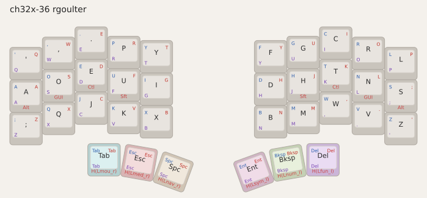
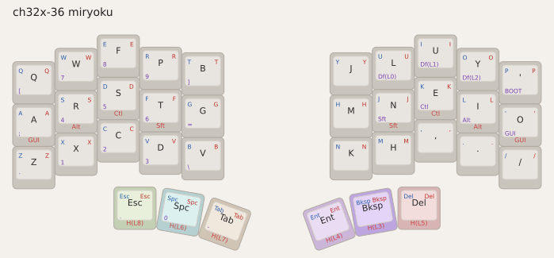
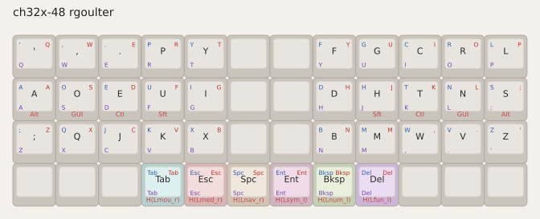
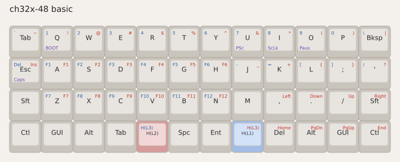
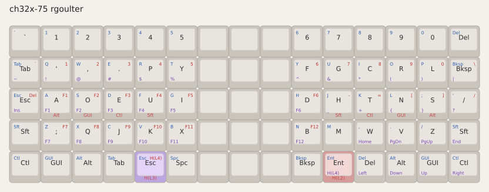
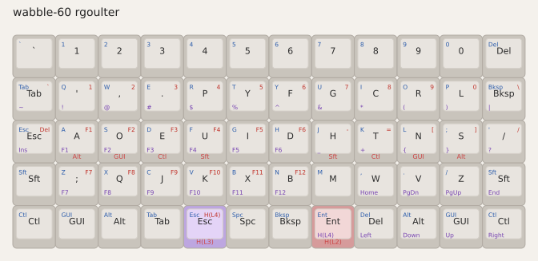
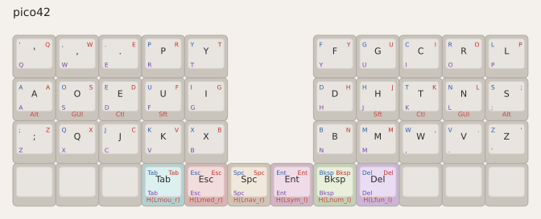

# Smart Keymap User Configuration

Repository with user-defined keyboards and keymaps
 for [smart-keymap](https://github.com/rgoulter/smart-keymap)-based firmware.

## Dependencies

[DevEnv](https://devenv.sh/) is used to provide the toolchain dependencies.

Use `devenv shell` to enter a shell which has all the tooling installed.

A [DevContainer](https://containers.dev/) is defined for the project, which can be used to easily get started using [e.g. VSCode, GitHub Codespaces, etc.](https://containers.dev/supporting).

## Building firmware

[Make](Makefile) is the build engine (dependency graph + artifacts).
[just](justfile) is the day-to-day chooser / flash helper.

```
just                  # list recipes
just list             # list firmware catalog names
just build-pick       # fzf: pick a firmware to build
just flash-pick       # fzf: pick a firmware to build + flash
just build ch32x_48-rgoulter
just flash pico42
make all              # build every artifact
```

Firmware artifacts depend on:

- the local keymap / board `.ncl` (and `src/bin/*.rs` for RP2040), and
- the **smart-keymap submodule commit** (via `.build/smart-keymap.rev`)

So a `git submodule update` correctly invalidates builds. Uncommitted edits
inside the submodule are not tracked — force with `just rebuild <name>` or
`make -B <artifact>` after developing smart-keymap in-tree.

### Pico42

[src/bin/pico42.rs](src/bin/pico42.rs) contains the Rust keyboard firmware, implemented using RTIC for the [Pico42 keyboard](https://github.com/rgoulter/keyboard-labs/releases/tag/pico42-rev2023.2).

Its keymap definition uses [keymaps/pico42/keymap.ncl](keymaps/pico42/keymap.ncl).

```
just build pico42     # → pico42.uf2
just flash pico42     # cargo run / probe
# or:
make pico42.uf2
```

### CH32X-48

Firmware for the
[CH32X-48](https://github.com/rgoulter/keyboard-labs/releases/tag/ch32x-48-rev2025.4)
is described by [keyboards/ch32x-48.ncl](keyboards/ch32x-48.ncl) and
[keymaps/ortho-4x12/keymap.ncl](keymaps/ortho-4x12/keymap.ncl).

```
just build ch32x_48-rgoulter
just flash ch32x_48-rgoulter   # awaits WCH bootloader, then wchisp
# or:
make firmware-ch32x_48-rgoulter.hex
just wch-flash firmware-ch32x_48-rgoulter.hex
```
## Keymap layouts

Diagrams are generated from the Nickel keymap definitions
 via [`tools/keymap-viz-rhombus`](https://github.com/rgoulter/smart-keymap/tree/master/tools/keymap-viz-rhombus)
 (Rhombus/Racket + Nickel + Inkscape), mirroring the pipeline in [keyboard-labs](https://github.com/rgoulter/keyboard-labs).

Each layout in `docs/keymaps/layouts/*/`
 has an `export-legend.ncl` (Nickel `bundle_of_with_index` → `legend-bundle/v0`)
 and a `layout.rhm` (Rhombus PointsIR → Scene → SVG).
`scripts/keymaps-viz.sh` runs them out-of-tree via `viz-path` into `docs/images/keyboards/<board>/`,
 then Inkscape renders PNGs.
Both `*-dense.svg` (one pane, corners encode layers 1-3)
 and `*-stacked.svg` (one pane per layer, palette-washed) are emitted.

```
# toolchain: racket + rhombus/rhombus-json, nickel 1.17+, inkscape
# (e.g. `devenv shell` in submodules/smart-keymap)
export KEYMAP_VIZ_ROOT=$PWD/submodules/smart-keymap/tools/keymap-viz-rhombus
just viz                 # all layouts
just viz ch32x_48_rgoulter  # one layout
```

Click the dense thumbnail to open the full stacked view.

### ch32x-36 (split 3×5+3) — `split_3x5+3` rgoulter

[](docs/images/keyboards/ch32x-36/ch32x-36-rgoulter-stacked.png)

### ch32x-36 miryoku — `split_3x5+3-miryoku`

[](docs/images/keyboards/ch32x-36/ch32x-36-miryoku-stacked.png)

### ch32x-48 (4×12) — `ortho-4x12` rgoulter

[](docs/images/keyboards/ch32x-48/ch32x-48-rgoulter-stacked.png)

### ch32x-48 basic — `ortho-4x12-basic`

[](docs/images/keyboards/ch32x-48/ch32x-48-basic-stacked.png)

### ch32x-75 (5×15) — `ortho-5x15` rgoulter

[](docs/images/keyboards/ch32x-75/ch32x-75-rgoulter-stacked.png)

### wabble-60 (5×12) — `ortho-5x12` rgoulter

[](docs/images/keyboards/wabble-60/wabble-60-rgoulter-stacked.png)

### pico42 (42) — `pico42`

[](docs/images/keyboards/pico42/pico42-stacked.png)

